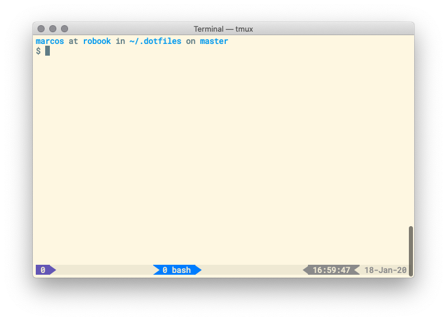

# dotfiles

💻 My personalized config files for unix systems

## Requirements

- [GNU stow](https://www.gnu.org/software/stow/)

## How to install?

```bash
$ git clone --recursive https://github.com/marcos-ro/dotfiles ~/.dotfiles
$ cd .dotfiles
$ stow home
```

## Preview

